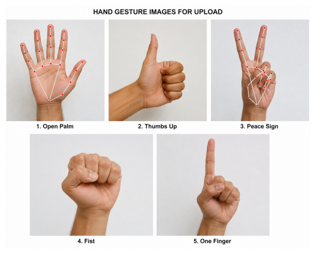
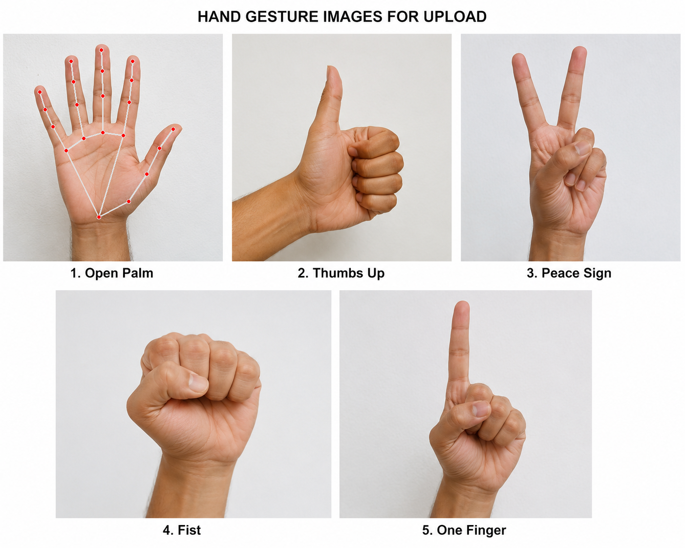

# ✋ Hand Gesture Recognition using MediaPipe and OpenCV

## 📌 Project Overview

Hand Gesture Recognition is a Computer Vision project that detects and analyzes hand gestures using MediaPipe and OpenCV. The system identifies hand landmarks, tracks finger positions, and recognizes common hand gestures from input images.

This project demonstrates the practical application of Machine Learning and Computer Vision techniques for gesture-based interaction systems.

**Developed as part of Task 4 of the SkillCraft Technology Machine Learning Internship Program.**

---

## 🎯 Objective

The objective of this project is to:

* Detect human hands in images.
* Extract hand landmarks using MediaPipe.
* Analyze finger positions.
* Recognize common hand gestures.
* Visualize hand landmarks and connections.

---

## 🛠️ Technologies Used

* Python
* OpenCV
* MediaPipe
* NumPy
* Google Colab

---

## 📂 Project Structure

```text
SCT_ML_04/
│
├── hand_gesture_recognition.ipynb
├── README.md
│
├── images/
│   └── hand_gestures.png
│
└── output/
    ├── open_palm_result.png
    ├── fist_result.png
    ├── peace_sign_result.png
    └── one_finger_result.png
```

---

## 📸 Input Image

The following composite image containing multiple hand gestures was used for testing:



---

## ⚙️ Methodology

1. Load the input image.
2. Convert the image from BGR to RGB format.
3. Detect hand landmarks using MediaPipe Hands.
4. Draw landmark points and hand connections.
5. Analyze finger positions for gesture recognition.
6. Display and save the processed output images.

---

## 📊 Results

The system successfully detected hand landmarks and visualized hand connections for various hand gestures.

### ✋ Open Palm

### ✊ Fist

### ✌️ Peace Sign

### ☝️ One Finger



---

## ✨ Features

* Accurate hand detection
* Hand landmark tracking
* Finger position analysis
* Gesture recognition
* Multiple gesture support
* Visual representation of landmarks and connections
* Easy implementation using MediaPipe and OpenCV

---

## 📈 Results Summary

The project successfully detects hand landmarks and recognizes different hand gestures based on finger positions. MediaPipe's hand-tracking model provides reliable and efficient landmark detection, making it suitable for gesture-based applications and human-computer interaction systems.

---

## 🚀 Future Enhancements

* Real-time webcam-based gesture recognition
* Dynamic gesture detection
* Deep Learning-based gesture classification
* Sign Language Recognition
* Gesture-controlled applications
* Human-Computer Interaction systems

---

## 📚 Learning Outcomes

Through this project, I gained hands-on experience in:

* Computer Vision
* Hand Landmark Detection
* OpenCV Image Processing
* MediaPipe Framework
* Gesture Recognition Techniques
* Human-Computer Interaction Concepts

---

## 👩‍💻 Internship Details

**Internship:** Machine Learning Internship
**Organization:** SkillCraft Technology
**Task:** Task 4 – Hand Gesture Recognition

---

## 🙏 Acknowledgements

* MediaPipe by Google
* OpenCV Community
* SkillCraft Technology Internship Program

---

## 📄 License

This project is developed for educational and internship learning purposes.

## 👩‍💻 Author

Divya Sai Sri Javvadi

Machine Learning Internship Project – Task 4 | SkillCraft Technology
